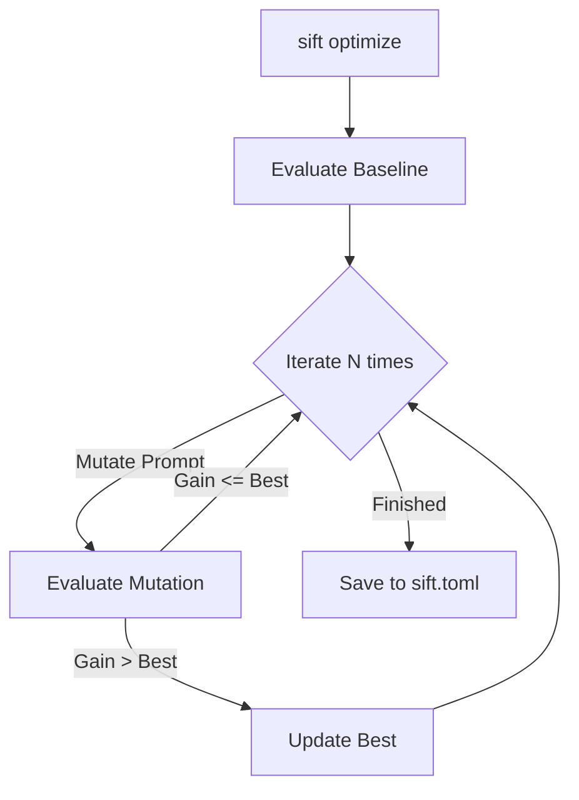

# Configurable Prompts - SDD

> Allow users to override HyDE, SPLADE, and Classification prompts via sift.toml.

## Architecture

This voyage extends the `SearchEngine` architecture by making the `GenerativeExpansionStrategy` implementations dynamic rather than static. It introduces an offline optimization loop to mutate those strategies.

## Design Decisions

### 1. Configuration Schema

We will add a `[prompts]` section to the `Config` struct in `src/config.rs`:

```rust
pub struct PromptConfig {
    pub hyde: Option<String>,
    pub splade: Option<String>,
    pub classified: Option<String>,
}
```

### 2. Strategy Instantiation

`SearchServiceBuilder::build` will be updated to accept a `PromptConfig` and instantiate `HydeStrategy`, `SpladeStrategy`, and `ClassifiedStrategy` with the overridden strings.

### 3. The Optimizer Loop

The `sift optimize` command will implement a simple greedy hill-climbing algorithm:
1.  Load the baseline prompts.
2.  Run an evaluation over the provided dataset, extracting the `Signal Gain` from `ReactorMetrics`.
3.  Use the LLM to mutate one prompt at a time (e.g., "Make this prompt more specific to Rust code").
4.  Run the evaluation again. If the Signal Gain improves, keep the mutation.
5.  After N iterations, save the best performing prompts to `./sift.toml`.

## Diagram

