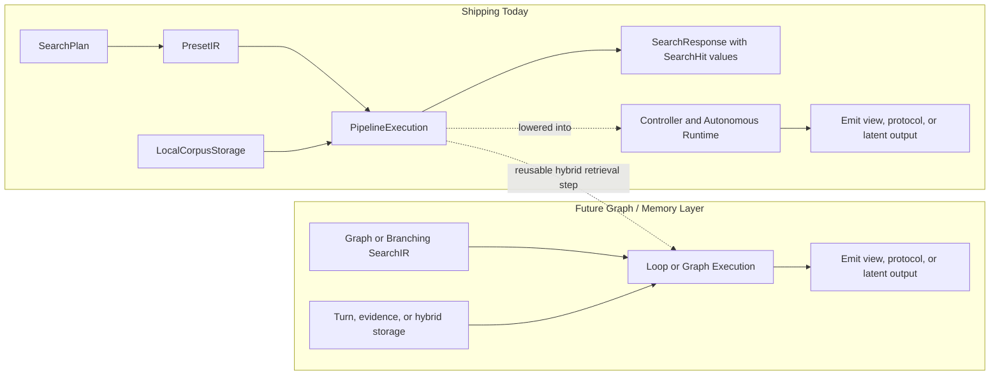

# Architecture

Sift is designed using **Domain-Driven Design (DDD)** and **Hexagonal
Architecture (Ports and Adapters)** principles. It is evolving from a
single-pass hybrid retrieval engine into a **High-Energy Information Reactor**
for hybrid and agentic search. Today the shipped runtime includes direct local
search, deterministic turn-aware/controller APIs, bounded linear and graph
autonomous planner runtimes, autonomous/controller evaluation, and CLI agent
mode through `sift search --agent`. The next architectural layer is richer
persisted agent memory and more adaptive graph execution over the same
substrate.

## Core Tenets

1. **Information Physics:** Search is viewed as a two-stage process: **Magnetism** (pulling relevant mass into a containment field) and **Fusion** (reacting upon that mass to emit intent-aligned energy).
2. **Modular Reactor:** The engine is governed by formal traits (`SearchIR`, `SearchExecution`, `SearchStorage`), enabling pluggable components.
3. **Hybrid and Agentic Search:** The hybrid retrieval core remains the substrate; agentic search is an explicit orchestration layer over that substrate.
4. **Multi-Modal Emission:** Retrieval and orchestration should be decoupled from presentation so the same core can serve humans, libraries, and agents.
5. **Pure Rust:** Sift is a pure-Rust application, with no external C++ or database dependencies.

## The Reactor Architecture

The search process is orchestrated by a unified **Reactor** interface (the
`SearchEngine` trait) that binds four specialized layers:

### 1. The Domain (`src/search/domain.rs`)
Defines the vocabulary of retrieval centered on `Document` today, plus the core
trait boundaries (`Expander`, `Retriever`, `Fuser`, `Reranker`,
`GenerativeModel`, `Conversation`). The shipping domain also includes public
turn-aware and autonomous request/response contracts, retained-artifact
records, bounded graph episode state, planner traces, planner stop reasons,
and synthetic local-context artifacts. A richer first-class agent memory model
is still planned beyond those DTOs.

### 2. SearchIR (The Magnetic Field Configuration)
The Intermediate Representation (IR) translates user queries into an executable
plan. Today `SearchIR` is a thin wrapper around `SearchPlan`; the target state
is a richer **Graph of Operations** that can express branching and iterative
agentic search. In the shipped direct-search substrate, the most expressive
plan family now combines lexical, exact, path-fuzzy, segment-fuzzy, and vector
lanes before shortlist reranking.

### 3. SearchExecution (The Fusion Runtime)
Orchestrates traversal of the plan or graph and the reaction process. Today the
default runtime is a sequential `PipelineExecution`; by keeping execution as a
trait, Sift can grow toward turn-based controllers, parallel walks, or other
specialized runtimes. The current runtime already executes multiple retriever
lanes and fuses them through RRF before applying deterministic or model-backed
reranking.

### 4. SearchStorage (The Mass Repository)
Abstracts the corpus and indices. Today the primary storage is the local
filesystem corpus. The same seam is intended to support alternate backends,
including remote corpora and future turn stores.

## Agentic Search Direction

Sift is being extended toward searching and surfacing **Agent Turns** and other
intermediate artifacts that matter in coding workflows. The current codebase
already exposes explicit turn requests, controller state, retained artifacts,
planner state, bounded graph episode state, planner traces, and local
synthetic context sources. Bounded linear and graph autonomous planning are
formalized now; what remains open is a richer persisted turn model and more
adaptive graph execution.

### Emission Modes
The reactor is intended to expose configurable ports for different types of
output:
- **Visual Emission (implemented):** `SearchResponse` style results for the CLI and library.
- **Protocol Emission (implemented):** Structured turn-aware records through `SearchEmissionMode::Protocol`.
- **Latent Emission (implemented):** Ranking-oriented latent hits through `SearchEmissionMode::Latent`.

## Intent-Driven Retrieval (Catalysis)

Sift uses local LLMs (Qwen 2.5, Gemma 3) to understand and expand user intent, acting as a catalyst for the retrieval reaction:
- **Explicit Intent:** Guides search via the `--intent` flag.
- **HyDE:** Generates hypothetical answers to bridge semantic gaps.
- **SPLADE:** Predicts semantically related technical terms.
- **Classification:** Categorizes queries (e.g., BUGFIX) to add intent-specific keywords.

The current architectural seam already supports bounded autonomous planners
that can decompose a root task into retrieval turns, branch across an explicit
frontier, decide when to continue, and manage context budgets without leaving
the local runtime. The next layer is attaching richer persisted mission or
turn memory and a more expressive graph IR to that shipped seam.

## The Incremental File Cache (`src/cache/`)

Sift employs a Zig-inspired incremental caching system to make repeat searches nearly instant.

### 1. Metadata Store (Manifests)
Maps filesystem heuristics (`inode`, `mtime`, `size`) to a strong content hash.

### 2. Content-Addressable Blob Store (CAS)
Stores binary serialized assets, including extracted text, term frequencies, and pre-computed dense vector embeddings. This allows search to run at dot-product speeds by bypassing neural network inference on subsequent queries.

## Performance Guardrails

- **SIMD Acceleration:** Optimized `dot_product` calculations via the `wide` crate for 7x speedups.
- **Mapped I/O:** Uses `mmap` for reading document blobs to minimize system call overhead.
- **Query Embedding Cache:** Session-level cache eliminates redundant inference for identical queries.
- **Structured Telemetry:** Uses the `tracing` crate for waterfall visualization of phase latency.

## Implementation Status

### Implemented now
- A composable hybrid retrieval core (`SearchPlan`, retrievers, fusion, reranking).
- Structural fuzzy retrieval lanes for path intent and snippet-bearing segment evidence inside the same direct-search substrate.
- Trait seams for `SearchEngine`, `SearchIR`, `SearchExecution`, and `SearchStorage`.
- Local generative model access and stateful `Conversation` hooks.
- CLI surfaces for direct search, `search --agent`, and evaluation.
- Library surfaces for `search`, `assemble_context`, `search_turn`, `search_controller`, and `search_autonomous`.
- Bounded linear and graph autonomous planner runtimes with heuristic and model-driven planner strategies.
- Planner traces, graph replay helpers, stop reasons, and retained-artifact carryover in the public autonomous contracts.
- `view`, `protocol`, and `latent` emission modes for turn-aware responses.
- Agentic evaluation comparing linear autonomy, graph autonomy, planned-controller, and collapsed single-turn baselines.

### Not formalized yet
- A first-class persisted `AgentTurn` domain model.
- A richer graph IR beyond the current bounded graph episode contract.
- A general-purpose interactive agentic CLI command.

## Adapters (`src/search/adapters/`)

Adapters implement the core search traits, enabling pluggable behavior across the reactor:

### 1. Expansion (`Expander`)
- **LlmExpander:** Uses local LLMs for generative expansion (HyDE, SPLADE, Classified).
- **SynonymExpander:** Rule-based synonym matching.

### 2. Retrieval (`Retriever`)
- **Bm25Retriever:** Lexical scoring using the BM25 algorithm.
- **PhraseRetriever:** High-precision exact phrase matching.
- **PathFuzzyRetriever:** Approximate filename and path-component matching for path-shaped intent.
- **SegmentFuzzyRetriever:** Typo-tolerant fuzzy line/segment matching that returns snippet-bearing evidence.
- **SegmentVectorRetriever:** Semantic scoring via dense vector embeddings.

The page-index preset family uses all five retrieval lanes together. That
combination is intentional: BM25 and phrase matching preserve exactness, path
fuzzy covers filename intent, segment fuzzy produces synthesis-ready snippets,
and vector retrieval bridges semantic vocabulary gaps.

### 3. Fusion (`Fuser`)
- **RrfFuser:** Combines multiple candidate lists using Reciprocal Rank Fusion (RRF).

### 4. Reranking (`Reranker`)
- **PositionAwareReranker:** Applies deterministic structural bonuses for path, filename stem, heading, and definition-like snippet matches.
- **QwenReranker:** Deep semantic reranking using the Qwen 2.5 family.
- **GemmaReranker:** Deep semantic reranking using the Gemma 3 family.
- **JinaReranker:** Integration with Jina Reranker v3 for high-precision cross-encoding.

`PositionAwareReranker` is the lightweight structural compression stage. It is
not a placeholder for deep semantics; its job is to turn the fused shortlist
into a better-ordered direct-search result set using bounded deterministic
signals that downstream controllers and synthesis consumers can reason about.
