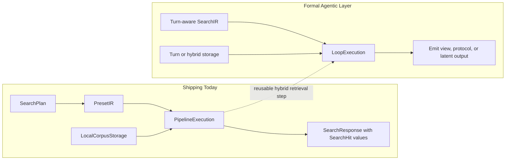

# Architecture

Sift is designed using **Domain-Driven Design (DDD)** and **Hexagonal
Architecture (Ports and Adapters)** principles. It is evolving from a
single-pass hybrid retrieval engine into a **High-Energy Information Reactor**
for hybrid and agentic search. Today the shipped runtime searches local files;
the architecture is being extended toward turn-based search controllers and
agent-facing emissions.

## Core Tenets

1. **Information Physics:** Search is viewed as a two-stage process: **Magnetism** (pulling relevant mass into a containment field) and **Fusion** (reacting upon that mass to emit intent-aligned energy).
2. **Modular Reactor:** The engine is governed by formal traits (`SearchIR`, `SearchExecution`, `SearchStorage`), enabling pluggable components.
3. **Hybrid and Agentic Search:** The hybrid retrieval core remains the substrate; agentic search is an explicit orchestration layer over that substrate.
4. **Multi-Modal Emission:** Retrieval and orchestration should be decoupled from presentation so the same core can serve humans, libraries, and agents.
5. **Pure Rust:** Sift is a pure-Rust application, with no external C++ or database dependencies.

## The Reactor Architecture

The search process is orchestrated by a unified **Reactor** interface (the
`SearchEngine` trait) that binds four specialized layers:

### 1. The Domain (`src/search/domain.rs`)
Defines the vocabulary of retrieval centered on `Document` today, plus the core
trait boundaries (`Expander`, `Retriever`, `Fuser`, `Reranker`,
`GenerativeModel`, `Conversation`). A first-class `AgentTurn` model is planned
by ADR but is not yet implemented in the shipping domain.

### 2. SearchIR (The Magnetic Field Configuration)
The Intermediate Representation (IR) translates user queries into an executable
plan. Today `SearchIR` is a thin wrapper around `SearchPlan`; the target state
is a richer **Graph of Operations** that can express branching and iterative
agentic search.

### 3. SearchExecution (The Fusion Runtime)
Orchestrates traversal of the plan or graph and the reaction process. Today the
default runtime is a sequential `PipelineExecution`; by keeping execution as a
trait, Sift can grow toward turn-based controllers, parallel walks, or other
specialized runtimes.

### 4. SearchStorage (The Mass Repository)
Abstracts the corpus and indices. Today the primary storage is the local
filesystem corpus. The same seam is intended to support alternate backends,
including remote corpora and future turn stores.

## Agentic Search Direction

Sift is being extended toward searching and surfacing **Agent Turns** and other
intermediate artifacts that matter in coding workflows. The current codebase
already exposes some of the required primitives, but the full turn protocol is
not formalized yet.

### Emission Modes
The reactor is intended to expose configurable ports for different types of
output:
- **Visual Emission (implemented):** Rendered, highlighted file results for the CLI and `SearchResponse`.
- **Protocol Emission (planned):** Structured domain records for agentic consumers.
- **Latent Emission (planned):** Raw embeddings or related feature vectors for external systems.

## Intent-Driven Retrieval (Catalysis)

Sift uses local LLMs (Qwen 2.5, Gemma 3) to understand and expand user intent, acting as a catalyst for the retrieval reaction:
- **Explicit Intent:** Guides search via the `--intent` flag.
- **HyDE:** Generates hypothetical answers to bridge semantic gaps.
- **SPLADE:** Predicts semantically related technical terms.
- **Classification:** Categorizes queries (e.g., BUGFIX) to add intent-specific keywords.

The next architectural layer is an explicit search controller that can decompose
queries into subqueries, iterate over retrieval turns, and manage context
budgets without leaving the local runtime.

## The Incremental File Cache (`src/cache/`)

Sift employs a Zig-inspired incremental caching system to make repeat searches nearly instant.

### 1. Metadata Store (Manifests)
Maps filesystem heuristics (`inode`, `mtime`, `size`) to a strong content hash.

### 2. Content-Addressable Blob Store (CAS)
Stores binary serialized assets, including extracted text, term frequencies, and pre-computed dense vector embeddings. This allows search to run at dot-product speeds by bypassing neural network inference on subsequent queries.

## Performance Guardrails

- **SIMD Acceleration:** Optimized `dot_product` calculations via the `wide` crate for 7x speedups.
- **Mapped I/O:** Uses `mmap` for reading document blobs to minimize system call overhead.
- **Query Embedding Cache:** Session-level cache eliminates redundant inference for identical queries.
- **Structured Telemetry:** Uses the `tracing` crate for waterfall visualization of phase latency.

## Implementation Status

### Implemented now
- A composable hybrid retrieval core (`SearchPlan`, retrievers, fusion, reranking).
- Trait seams for `SearchEngine`, `SearchIR`, `SearchExecution`, and `SearchStorage`.
- Local generative model access and stateful `Conversation` hooks.
- Library and CLI surfaces for human-readable file search results.

### Not formalized yet
- A first-class `AgentTurn` domain model.
- A graph IR beyond the current `SearchPlan` wrapper.
- A multi-turn search harness that performs decomposition, iteration, and context pruning.
- Explicit `emit_turns` / `emit_latent` style emission ports.

## Adapters (`src/search/adapters/`)

Adapters implement the core search traits, enabling pluggable behavior across the reactor:

### 1. Expansion (`Expander`)
- **LlmExpander:** Uses local LLMs for generative expansion (HyDE, SPLADE, Classified).
- **SynonymExpander:** Rule-based synonym matching.

### 2. Retrieval (`Retriever`)
- **Bm25Retriever:** Lexical scoring using the BM25 algorithm.
- **PhraseRetriever:** High-precision exact phrase matching.
- **SegmentVectorRetriever:** Semantic scoring via dense vector embeddings.

### 3. Fusion (`Fuser`)
- **RrfFuser:** Combines multiple candidate lists using Reciprocal Rank Fusion (RRF).

### 4. Reranking (`Reranker`)
- **PositionAwareReranker:** Applies structural bonuses (filename, heading matches).
- **QwenReranker:** Deep semantic reranking using the Qwen 2.5 family.
- **GemmaReranker:** Deep semantic reranking using the Gemma 3 family.
- **JinaReranker:** Integration with Jina Reranker v3 for high-precision cross-encoding.
