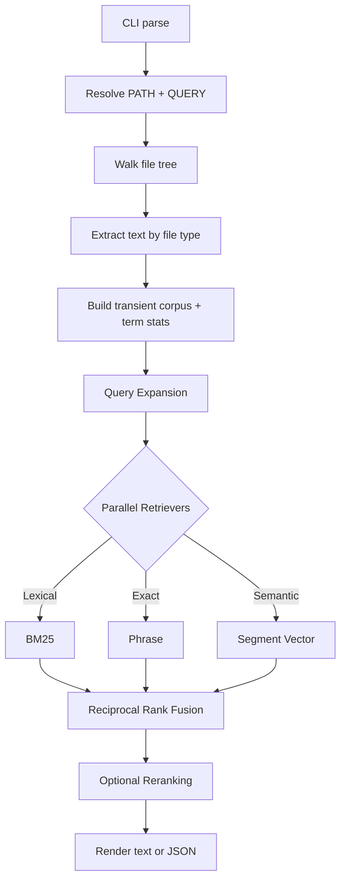

# sift

`sift` is a standalone Rust CLI for local document retrieval in agentic
workflows. It searches raw local corpora without a long-running daemon, uses a 
composable search strategy architecture, and keeps evaluation and benchmark workflows
inside the same binary.

The core idea is simple: point `sift` at a directory, extract text on demand,
and run a layered search pipeline (Expansion, Retrieval, Fusion, Reranking). 
There is no external database, no daemon, and no background indexing service.

## Current Contract

- Single Rust binary. No external database, daemon, or long-running service.
- Default `search` mode uses a configurable champion strategy (currently the `page-index` preset).
- Search execution is modeled as a layered pipeline: Query Expansion -> Retrieval -> Fusion -> Reranking.
- Corpus loading is transient and query-time (with aggressive incremental caching heuristics planned).
- Dense inference runs locally through Candle with
  `sentence-transformers/all-MiniLM-L6-v2` as the current default model.
- Supported inputs today: ASCII and UTF-8 text, HTML, text-bearing PDF, and
  OOXML Office files (`.docx`, `.xlsx`, `.pptx`).
- Target platforms are Linux and macOS. Windows is still unverified.

## How Sift Works

At runtime, `sift` follows this path:



In linear terms:

1. `sift search [PATH] <QUERY>` resolves the search root. If `PATH` is omitted,
   it searches the current directory.
2. The corpus is scanned recursively and text is extracted per file type.
3. `sift` builds an ephemeral in-memory corpus representation.
4. The strategy pipeline executes:
   - **Expansion:** The query is expanded into variants (e.g., synonyms).
   - **Retrieval:** Multiple retrievers (BM25, Phrase, Vector) score the corpus independently.
   - **Fusion:** Candidate lists are merged using Reciprocal Rank Fusion (RRF).
   - **Reranking:** An optional final pass (e.g., cross-encoder) finalizes the order.
5. Results are rendered as human-readable text or JSON.

## Design Choices

These are the deliberate tradeoffs behind the current design:

- **Composable Strategies:** Search is not a monolithic engine. It is a pipeline of independent domain concepts.
- **No sidecar index management:** Search structures are rebuilt or cached transparently so the tool stays stateless from the user's perspective.
- **Pure-Rust local inference:** Dense inference uses Candle and local model files instead of Python bindings or a separate model server.
- **One extraction boundary:** Text, HTML, PDF, and OOXML files all normalize into the same text-first search path.
- **Determinism:** Directory walking and tie-breaking are stable, which matters for agent workflows and benchmark reproducibility.

## Installation

For development, enter the shared shell first:

```bash
nix develop
```

Build locally and mirror the binary back into repo-local `target/`:

```bash
just build release
./target/release/sift --help
```

Install locally from source if you want `sift` on your `PATH`:

```bash
cargo install --path .
```

## Search

The default strategy (champion alias `hybrid`) is used automatically:

```bash
sift search tests/fixtures/rich-docs "architecture decision"
```

If you omit the path, `sift` searches the current directory:

```bash
sift search "architecture decision"
```

Request JSON output for agent consumption:

```bash
sift search --json tests/fixtures/rich-docs "quarterly roadmap"
```

Force a specific lexical-only strategy (e.g., `bm25`):

```bash
sift search --strategy bm25 tests/fixtures/rich-docs "service catalog"
```

Override dense model settings explicitly:

```bash
sift search \
  --model-id sentence-transformers/all-MiniLM-L6-v2 \
  --max-length 40 \
  ~/.cache/sift/eval/scifact-materialized \
  "retrieval architecture"
```

## Evaluation And Benchmarks

The evaluation loop uses the exact same ranking pipeline as normal search.

Download and materialize the SciFact evaluation corpus (defaults to `~/.cache/sift/eval`):

```bash
sift eval download scifact
sift eval materialize scifact
```

Measure hybrid quality against BM25:

```bash
sift bench quality \
  --strategy hybrid \
  --baseline bm25 \
  --corpus ~/.cache/sift/eval/scifact-materialized \
  --qrels ~/.cache/sift/eval/scifact/qrels/test.tsv
```

Measure search latency:

```bash
sift bench latency \
  --strategy hybrid \
  --corpus ~/.cache/sift/eval/scifact-materialized \
  --queries ~/.cache/sift/eval/scifact-materialized/test-queries.tsv
```

Benchmark reports include the exact command, corpus size, git SHA, hardware
summary, dense model settings, and measured metrics so results are traceable.

## Current Limits

- No OCR or scanned-image PDF recovery.
- No legacy binary Office formats (`.doc`, `.xls`, `.ppt`).
- No persisted database or background indexing service.

## License

MIT OR Apache-2.0
