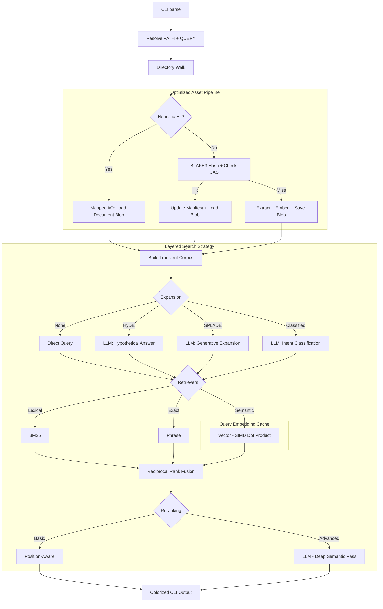

# sift

[](https://github.com/rupurt/sift/actions/workflows/ci.yml)
[](.keel/README.md)
[](RELEASE.md)

`sift` is a standalone Rust CLI and **Hybrid Information Retrieval (IR) system** for local document retrieval in agentic
workflows. It searches raw local corpora without a long-running daemon, uses a 
composable search strategy architecture, and employs a Zig-style heuristic 
caching system for near-instant repeated queries.

The core idea is simple: point `sift` at a directory, extract text on demand,
and run a layered search pipeline (Expansion, Retrieval, Fusion, Reranking). 
There is no external database, no daemon, and no background indexing service.

For the project background and design rationale, read the introductory post:
[`Sift: Local Hybrid Search Without the Infrastructure Tax`](https://www.alexdk.com/blog/introducing-sift).

## Current Contract

- **Single Rust Binary:** No external database, daemon, or long-running service.
- **Pure-Rust Toolchain:** No C++ dependencies, enabling easy static binary distribution.
- **High Performance:** SIMD-accelerated scoring and memory-mapped I/O for 
  ultra-fast retrieval on large corpora.
- **Default Strategy:** Uses the `page-index-hybrid` champion preset (Lexical + Semantic).
- **Layered Pipeline:** Query Expansion -> Retrieval -> Fusion -> Reranking.
- **Heuristic Incremental Caching:** Uses `mtime`, `inode`, and `size` to bypass 
  extraction and hashing for unchanged files.
- **Fully Processed Assets:** Cache blobs contain text, term stats, and pre-computed
  dense vector embeddings, enabling search at dot-product speeds.
- **Inference & Reranking:** Runs locally through Candle with support for 
  both dense embeddings and advanced LLM reranking (e.g., Qwen2.5).
- **Supported Inputs:** Text, HTML, PDF, and OOXML files (`.docx`, `.xlsx`, `.pptx`).

## Installation

### Homebrew (macOS and Linux)

```bash
brew tap rupurt/homebrew-tap
brew install sift
```

### One-liner Install (macOS and Linux)

```bash
curl --proto '=https' --tlsv1.2 -LsSf https://github.com/rupurt/sift/releases/latest/download/sift-installer.sh | sh
```

### Manual Download

Download the latest pre-built binaries and installers for your platform from the [GitHub Releases](https://github.com/rupurt/sift/releases) page. We provide:
- **Linux:** `.tar.gz` archives plus the cross-platform shell installer
- **macOS:** `.tar.gz` archives plus the cross-platform shell installer
- **Windows:** `.zip` archives, `.msi`, and the PowerShell installer

## Embedded Library

`sift` can also be embedded from another Rust project. The supported library
contract lives at the crate root:

- `Sift`, `SiftBuilder`
- `SearchInput`, `SearchOptions`
- `Retriever`, `Fusion`, `Reranking`
- `SearchResponse`, `SearchHit`, `ScoreConfidence`

Everything under `sift::internal` exists to support the bundled executable,
benchmarks, and repository-internal tests. It is not part of the supported
embedding contract and may change without notice.

### Runnable Example Consumer

[`examples/sift-embed`](examples/sift-embed) is the canonical runnable
embedding reference. It is a standalone Rust crate that depends on `sift`
through the crate-root facade and exposes a minimal `sift-embed` CLI.

From the repo root:

```bash
just embed-build
just embed-search tests/fixtures/rich-docs "architecture decision"
```

The embedded example supports the same shape directly:

```bash
cargo run --manifest-path examples/sift-embed/Cargo.toml -- search "hybrid search"
cargo run --manifest-path examples/sift-embed/Cargo.toml -- search tests/fixtures/rich-docs "architecture decision"
```

If `PATH` is omitted, `sift-embed search "<term>"` searches the current
directory. See [`examples/sift-embed/README.md`](examples/sift-embed/README.md)
for the full runnable example notes.

### Add The Dependency

Use the git repository until a versioned registry release is part of your
delivery path:

```toml
[dependencies]
sift = { git = "https://github.com/rupurt/sift" }
```

For local development against a checked-out copy:

```toml
[dependencies]
sift = { path = "../sift" }
```

### Minimal Embedding Example

```rust
use sift::{Retriever, Reranking, SearchInput, SearchOptions, Sift};

fn main() -> anyhow::Result<()> {
    let sift = Sift::builder().build();

    let response = sift.search(
        SearchInput::new("./docs", "hybrid search")
            .with_options(
                SearchOptions::default()
                    .with_strategy("bm25")
                    .with_retrievers(vec![Retriever::Bm25])
                    .with_reranking(Reranking::None)
                    .with_limit(5)
                    .with_shortlist(5),
            ),
    )?;

    for hit in response.results {
        println!("{} {}", hit.rank, hit.path.display());
    }

    Ok(())
}
```

Embedders should consume `SearchResponse` directly and own their own rendering.
Helpers under `sift::internal` are executable support code, not stable library
API.

## How Sift Works

At runtime, `sift` orchestrates a high-performance asset pipeline:



## Performance & Scalability

`sift` is optimized for speed without sacrificing its stateless UX:
- **Zero-Inference Search:** On repeated queries, neural network inference is bypassed entirely by loading pre-computed embeddings and reusing query embeddings from the session cache.
- **SIMD Acceleration:** Vector similarity calculations use hardware-specific SIMD instructions for a ~7x speedup over standard scalar implementations.
- **Mapped I/O:** Document retrieval from the global cache uses `mmap` to minimize system call overhead and leverage OS-level paging.
- **Fast Path Heuristics:** Filesystem metadata checks happen in microseconds, allowing `sift` to skip hashing for unchanged files.

## Search Examples

The default strategy (champion alias `page-index-hybrid`) is used automatically:

```bash
sift search tests/fixtures/rich-docs "architecture decision"
```

Force a specific strategy or override components:

```bash
# Lexical only (no vectors)
sift search --strategy page-index "service catalog"

# Semantic only (vectors)
sift search --strategy vector "architecture"

# Custom mix
sift search --retrievers bm25,vector --reranking none "query"
```

### Verbose Mode
Trace the pipeline and timings at different levels:
- `-v`: Phase timings (Loading, Retrieval, etc.)
- `-vv`: Detailed retriever timings and cache hit/miss traces.
- `-vvv`: Granular internal scoring data.

## Configuration & Customization

- **[USER_GUIDE.md](USER_GUIDE.md):** The comprehensive guide to getting started and mastering Sift.
- **[CONFIGURATION.md](CONFIGURATION.md):** Technical guide to `sift.toml`, available strategies, and environment variables.
- **[EVALUATION.md](EVALUATION.md):** How to manage datasets and run quality/latency evaluations.
- **[ARCHITECTURE.md](ARCHITECTURE.md):** Deep dive into the hexagonal modular engine and asset pipeline.

## License

This project is licensed under the [MIT License](LICENSE).
