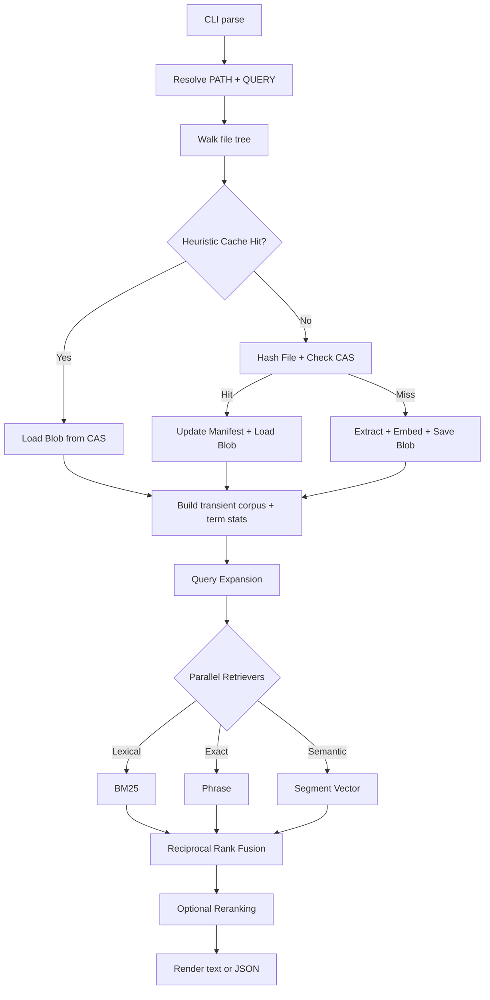

# sift

`sift` is a standalone Rust CLI for local document retrieval in agentic
workflows. It searches raw local corpora without a long-running daemon, uses a 
composable search strategy architecture, and employs a Zig-style heuristic 
caching system for near-instant repeated queries.

The core idea is simple: point `sift` at a directory, extract text on demand,
and run a layered search pipeline (Expansion, Retrieval, Fusion, Reranking). 
There is no external database, no daemon, and no background indexing service.

## Current Contract

- Single Rust binary. No external database, daemon, or long-running service.
- Pure-Rust toolchain. No C++ dependencies, enabling easy static binary distribution.
- Default `search` mode uses a configurable champion strategy (currently the `page-index` preset).
- Search execution is modeled as a layered pipeline: Query Expansion -> Retrieval -> Fusion -> Reranking.
- Heuristic Incremental Caching. Uses `mtime`, `inode`, and `size` to bypass 
  extraction and hashing for unchanged files, keeping repeat searches sub-second.
- Dense inference runs locally through Candle with
  `sentence-transformers/all-MiniLM-L6-v2` as the current default model.
- Supported inputs today: ASCII and UTF-8 text, HTML, text-bearing PDF, and
  OOXML Office files (`.docx`, `.xlsx`, `.pptx`).
- Target platforms are Linux and macOS. Windows is still unverified.

## How Sift Works

At runtime, `sift` follows this path:



In linear terms:

1. `sift search [PATH] <QUERY>` resolves the search root.
2. The corpus is scanned. For each file, `sift` checks a global manifest 
   (`~/.cache/sift/manifests/`) using fast filesystem heuristics (`mtime`, `size`, `inode`).
3. If a match is found, the pre-computed `Document` (including text and term 
   stats) is loaded from the Content-Addressable Blob Store (`~/.cache/sift/blobs/`).
4. If a miss occurs, the file is hashed (BLAKE3) and extracted. The result is 
   cached for future runs.
5. The strategy pipeline executes:
   - **Expansion:** The query is expanded into variants (e.g., synonyms).
   - **Retrieval:** Multiple retrievers score the corpus independently.
   - **Fusion:** Candidate lists are merged using Reciprocal Rank Fusion (RRF).
   - **Reranking:** An optional final pass finalizes the order.
6. Results are rendered as human-readable text or JSON.

## Design Choices

These are the deliberate tradeoffs behind the current design:

- **Composable Strategies:** Search is not a monolithic engine. It is a pipeline of independent domain concepts.
- **Zig-style Caching:** Near-instant indexing for repeat queries without a background daemon or database. The cache is a "Search Asset Pipeline" in `~/.cache/sift/`.
- **Pure-Rust local inference:** Dense inference uses Candle and local model files instead of Python bindings or a separate model server.
- **One extraction boundary:** Text, HTML, PDF, and OOXML files all normalize into the same text-first search path.
- **Stateless UX:** No sidecar index management. `sift` stays out of your project directories.

## Installation

For development, enter the shared shell first:

```bash
nix develop
```

Build locally and mirror the binary back into repo-local `target/`:

```bash
just build release
./target/release/sift --help
```

Install locally from source if you want `sift` on your `PATH`:

```bash
cargo install --path .
```

## Search

The default strategy (champion alias `hybrid`) is used automatically:

```bash
sift search tests/fixtures/rich-docs "architecture decision"
```

If you omit the path, `sift` searches the current directory:

```bash
sift search "architecture decision"
```

Force a specific lexical-only strategy (e.g., `bm25`):

```bash
sift search --strategy bm25 tests/fixtures/rich-docs "service catalog"
```

## Evaluation And Benchmarks

The evaluation loop uses the exact same ranking pipeline as normal search.

Download and materialize the SciFact evaluation corpus:

```bash
sift eval download scifact
sift eval materialize scifact
```

Measure hybrid quality against BM25:

```bash
sift bench quality \
  --strategy hybrid \
  --baseline bm25 \
  --corpus ~/.cache/sift/eval/scifact-materialized \
  --qrels ~/.cache/sift/eval/scifact/qrels/test.tsv
```

## License

MIT OR Apache-2.0
