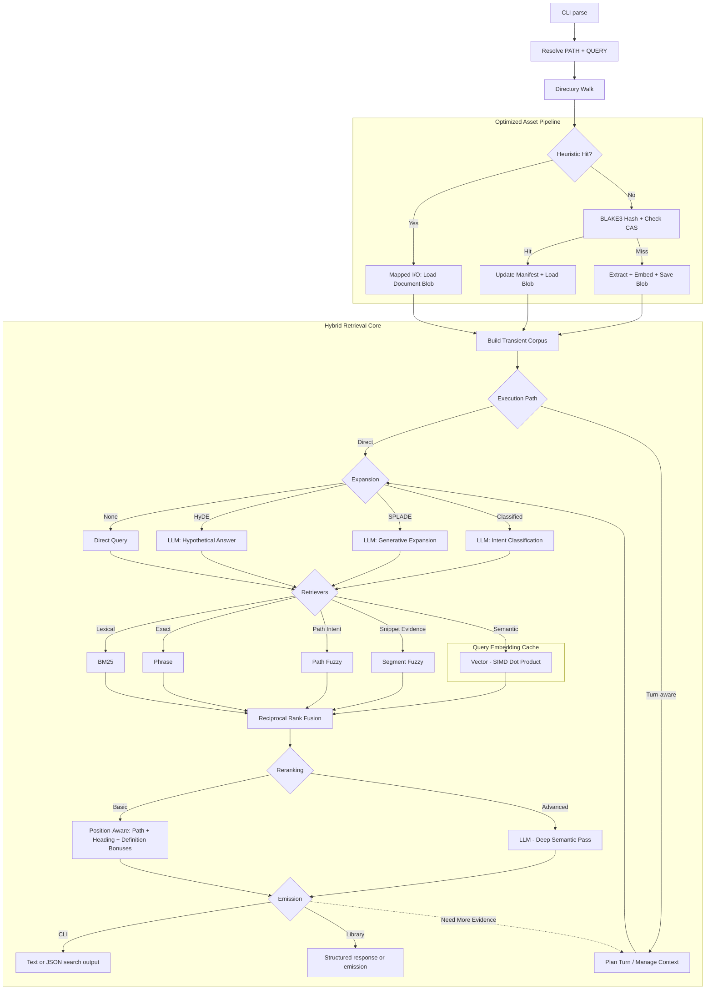

# sift

[](https://github.com/rupurt/sift/actions/workflows/ci.yml)
[](.keel/README.md)
[](RELEASE.md)

`sift` is a standalone Rust CLI and library for hybrid and agentic local search
in development workflows. The shipped executable gives you direct search,
planner-driven `search --agent`, evaluation, dataset, and prompt-optimization
commands; the crate-root library facade exposes direct, controller, and
autonomous search APIs for embedding.

The core idea is simple: point `sift` at a directory, extract text on demand,
and run a layered pipeline of expansion, retrieval, fusion, and reranking.
Agentic behavior in Sift is built on top of that same retrieval substrate
rather than replacing it with a separate service or daemon.

For project background and design rationale, read the introductory post:
[`Sift: Local Hybrid Search Without the Infrastructure Tax`](https://www.alexdk.com/blog/introducing-sift).

## Current Contract

- **Single Rust binary:** No external database, daemon, or long-running service.
- **Local-first retrieval:** Search runs over local corpora with transparent caching in standard user cache directories.
- **Shared runtime cache:** Direct search, `search --agent`, and the crate-root controller/autonomous APIs reuse the same cache root across fresh processes.
- **Visible indexing:** Interactive `sift search` runs show live stderr progress for indexing and cache reuse while preparation is in flight.
- **Default interactive strategy:** The default config strategy is `hybrid`.
- **Current champion preset:** `page-index-hybrid` is the richer benchmark preset, combining BM25, phrase, path-fuzzy, segment-fuzzy, and vector retrieval before structural reranking.
- **Layered pipeline:** Query Expansion -> Retrieval -> Fusion -> Reranking.
- **Executable surface:** `search`, `eval`, `dataset`, `optimize`, and `config` are the supported CLI commands.
- **Library surface:** `search`, `search_with_progress`, `assemble_context`, `search_turn`, `search_controller`, and `search_autonomous` are supported at the crate root.
- **Autonomous planning:** Bounded linear and graph autonomous planning ship through `sift search --agent` and `Sift::search_autonomous`, with heuristic and model-driven planner strategies.
- **Emission modes:** Turn-aware library calls can emit `view`, `protocol`, or `latent` responses.
- **Supported inputs:** Text, HTML, PDF, and OOXML files (`.docx`, `.xlsx`, `.pptx`).

## Installation

### Homebrew (macOS and Linux)

```bash
brew tap rupurt/homebrew-tap
brew install sift
```

### One-liner Install (macOS and Linux)

```bash
curl --proto '=https' --tlsv1.2 -LsSf https://github.com/rupurt/sift/releases/latest/download/sift-installer.sh | sh
```

### Manual Download

Download the latest pre-built binaries and installers for your platform from the [GitHub Releases](https://github.com/rupurt/sift/releases) page. We provide:
- **Linux:** `.tar.gz` archives plus the cross-platform shell installer
- **macOS:** `.tar.gz` archives plus the cross-platform shell installer
- **Windows:** `.zip` archives, `.msi`, and the PowerShell installer

## CLI Interface

The executable currently exposes the following command groups:

| Command | Purpose |
|---------|---------|
| `sift search [OPTIONS] [PATH] <QUERY>` | Direct single-turn search over a local corpus. |
| `sift search [OPTIONS] [PATH] --agent <ROOT_TASK>` | Planner-driven search over a local corpus using the shared autonomous runtime, with optional `--agent-mode linear|graph`, `--planner-strategy`, and `--planner-profile` selection. |
| `sift eval all` | Compare all registered retrieval strategies. |
| `sift eval quality` | Emit a JSON quality report for one strategy, optionally against a baseline. |
| `sift eval latency` | Emit a JSON latency report for one strategy. |
| `sift eval agentic` | Benchmark linear autonomous, graph autonomous, planned controller, and collapsed single-turn baselines. |
| `sift dataset download` / `sift dataset materialize` | Manage evaluation datasets such as SciFact. |
| `sift optimize` | Tune prompt templates used by generative expansion. |
| `sift config` | Print the merged effective configuration. |

There is not a separate `sift agentic` interactive shell. Agent-mode search
ships through `sift search --agent`, while evaluation-oriented benchmarking
continues to live under `eval agentic`.

## Search Examples

Search with the default configured strategy (`hybrid` unless overridden in
`sift.toml`):

```bash
sift search tests/fixtures/rich-docs "architecture decision"
```

Run the current benchmark champion preset explicitly:

```bash
sift search --strategy page-index-hybrid tests/fixtures/rich-docs "architecture decision"
```

Use the focused path-heavy preset when filename or path intent dominates:

```bash
sift search --strategy path-hybrid src "sift_request_factory"
```

Use a simpler lexical-only plan:

```bash
sift search --strategy bm25 "service catalog"
```

Use a vector-only plan:

```bash
sift search --strategy vector "architecture"
```

Run the supported autonomous planner runtime from the CLI:

```bash
sift search --strategy bm25 tests/fixtures/rich-docs --agent "find the cache invalidation path"
```

Switch the shared autonomous runtime into bounded graph mode:

```bash
sift search --strategy bm25 tests/fixtures/rich-docs \
  --agent "find the cache invalidation path" --agent-mode graph
```

Select the built-in model-driven planner explicitly:

```bash
sift search --strategy hybrid --agent "trace the cache invalidation path" \
  --planner-strategy model-driven --planner-profile local-planner-v1
```

Override individual pipeline stages:

```bash
sift search --retrievers bm25,path-fuzzy,segment-fuzzy --reranking position-aware "query"
```

Emit JSON instead of text:

```bash
sift search --json "query"
```

Interactive text-mode `sift search` writes transient progress to stderr while
the corpus is being prepared. That progress includes file counts plus cache and
BM25 reuse/build metrics so the first run does not look hung. The same cache
root is reused by direct and agent-mode runs, and bounded dirty-sector rebuilds
preserve reuse for unchanged sectors after fresh restarts.

### Verbose Mode

Trace the pipeline and timings at different levels:

- `-v`: Phase timings
- `-vv`: Detailed retriever timings and cache traces
- `-vvv`: Granular internal scoring data

## Strategy Guide

Use the shipped presets intentionally:

- `hybrid`: Lowest-friction default when you want BM25 plus semantic recall without structural reranking.
- `path-hybrid`: Best when the query is shaped like a filename, path fragment, module, or symbol stem and you want deterministic path-sensitive reranking.
- `page-index-hybrid`: Best all-around direct-search preset when you want stronger recall plus snippet-bearing structural evidence for downstream synthesis or context assembly.
- `page-index-llm` / `page-index-jina` / `page-index-gemma`: Best when the richer shortlist is already useful and you want a heavier semantic pass on top of it.

The structural fuzzy lanes are intentionally narrow:

- `path-fuzzy` recovers artifacts from approximate filename and path-component intent.
- `segment-fuzzy` recovers typo-tolerant line and segment evidence, which is especially useful when a downstream tool needs snippet-bearing support rather than just an artifact path.

## Embedded Library

`sift` can also be embedded from another Rust project. The supported public
surface lives at the crate root and includes:

- `Sift`, `SiftBuilder`
- `SearchInput`, `SearchOptions`
- `ContextAssemblyRequest`, `ContextAssemblyResponse`
- `SearchTurnRequest`, `SearchTurnResponse`
- `SearchControllerRequest`, `SearchControllerResponse`
- `AutonomousSearchRequest`, `AutonomousSearchResponse`
- `AutonomousSearchMode`, `AutonomousPlannerState`, `AutonomousPlannerStrategy`, `AutonomousPlannerStrategyKind`
- `AutonomousPlannerTrace`, `AutonomousPlannerDecision`, `AutonomousPlannerStopReason`
- `AutonomousPlanner`, `HeuristicAutonomousPlanner`, `ModelDrivenAutonomousPlanner`
- `AutonomousGraphEpisodeState`, `AutonomousGraphNode`, `AutonomousGraphEdge`, `AutonomousGraphFrontierEntry`, `replay_graph_trace`
- `SearchEmission`, `SearchEmissionMode`
- `SearchPlan`, `QueryExpansionPolicy`, `RetrieverPolicy`, `FusionPolicy`, `RerankingPolicy`
- `Retriever`, `Fusion`, `Reranking`
- `SearchResponse`, `SearchHit`, `ContextArtifact`, `ContextArtifactKind`, `ScoreConfidence`
- `SearchProgress`, `SearchTelemetry`
- `ModelSource`, `ModelRuntimeContract`, `PreparedModel`, `ModelArtifactFormat`, `ModelPreparationMode`, `prepare_model`

Everything under `sift::internal` exists to support the bundled executable,
benchmarks, and repository-internal tests. It is not part of the stable
embedding contract.

Embedders that need stronger filename/path recall and synthesis-ready snippets
can opt into `SearchPlan::default_page_index_hybrid()` through the library
request types. That keeps planner ownership outside `sift`, which matches how
downstream tools such as `paddles` should consume the direct retrieval layer.

If an embedder only needs filename/path-heavy recovery, `SearchPlan::default_path_hybrid()`
is the lighter structural option. The intended `paddles` adoption path is still
explicit direct retrieval selection, not handing search planning back into
`sift`.

When you point `Sift::builder()` or `SearchOptions` at a cache directory, direct
search, controller execution, and autonomous runtime calls all reuse that same
sector-aware cache substrate. Fresh processes can mount clean sectors prepared
by another surface and only rebuild sectors touched by corpus changes.

See [LIBRARY.md](LIBRARY.md) for the full embedding guide, including direct
search, context assembly, deterministic controller execution, supported
autonomous search, protocol/latent emissions, local context injection, and the
advanced custom-planner seam.

### Runnable Example Consumer

[`examples/sift-embed`](examples/sift-embed) is the canonical runnable
embedding reference. It is a standalone Rust crate that depends on `sift`
through the crate-root facade and exposes a minimal `sift-embed` CLI.

From the repo root:

```bash
just embed-build
just embed-sift tests/fixtures/rich-docs "architecture decision"
```

You can also run the example directly:

```bash
cargo run --manifest-path examples/sift-embed/Cargo.toml -- search "agentic search"
cargo run --manifest-path examples/sift-embed/Cargo.toml -- search tests/fixtures/rich-docs "architecture decision"
```

If `PATH` is omitted, `sift-embed search "<term>"` searches the current
directory. See [`examples/sift-embed/README.md`](examples/sift-embed/README.md)
for the runnable example notes.

### Local Model Preparation

Embedders that need local model artifacts for the current Candle-backed runtime
can use the stable crate-root preparation seam:

```rust
use sift::{ModelRuntimeContract, ModelSource, prepare_model};

let prepared = prepare_model(
    ModelSource::hugging_face_revision("prism-ml/Bonsai-8B-gguf", "main"),
    ModelRuntimeContract::CandleSafetensorsBundle,
)?;
println!("{}", prepared.root.display());
```

This surface is a compatibility/preparation seam. If a source is already
compatible, sift reuses it. If the source is GGUF-backed, sift can invoke
metamorph to translate it into a Candle-loadable safetensors bundle. That
translation is lossy and does not preserve the original 1-bit runtime
efficiency; native 1-bit execution support remains a separate future project.

### Add The Dependency

Use the git repository until a versioned registry release is part of your
delivery path:

```toml
[dependencies]
sift = { git = "https://github.com/rupurt/sift" }
```

For local development against a checked-out copy:

```toml
[dependencies]
sift = { path = "../sift" }
```

### Minimal Embedding Example

```rust
use sift::{Fusion, Retriever, Reranking, SearchInput, SearchOptions, Sift};

fn main() -> anyhow::Result<()> {
    let sift = Sift::builder().build();

    let response = sift.search(
        SearchInput::new("./docs", "agentic search").with_options(
            SearchOptions::default()
                .with_strategy("bm25")
                .with_retrievers(vec![Retriever::Bm25])
                .with_fusion(Fusion::Rrf)
                .with_reranking(Reranking::None)
                .with_limit(5)
                .with_shortlist(5),
        ),
    )?;

    for hit in response.hits {
        println!("{} {}", hit.rank, hit.path);
    }

    Ok(())
}
```

## How Sift Works

At runtime, `sift` orchestrates a high-performance asset pipeline and retrieval
runtime that can be invoked directly or wrapped by a turn-aware controller:



Today the executable ships direct search, planner-driven `search --agent`, a
bounded graph mode, and evaluation-oriented autonomous/controller benchmarks.
The library exposes direct, controller, and supported autonomous surfaces over
the same retrieval substrate. The next formal layer is richer persisted agent
memory and more adaptive graph execution over the shipped bounded graph
contract.

## Performance & Scalability

`sift` is optimized for speed without sacrificing its stateless UX:

- **Zero-inference repeat search:** Reuses cached document blobs and query embeddings where possible.
- **SIMD acceleration:** Vector similarity calculations use hardware-specific SIMD instructions.
- **Mapped I/O:** Uses `mmap` for document blob reads.
- **Fast-path heuristics:** Filesystem metadata checks allow unchanged files to bypass hashing and extraction.

## Documentation Map

- **[USER_GUIDE.md](USER_GUIDE.md):** End-user guide for direct search workflows.
- **[CONFIGURATION.md](CONFIGURATION.md):** `sift.toml`, strategies, prompts, and environment variables.
- **[EVALUATIONS.md](EVALUATIONS.md):** Retrieval and agentic evaluation workflows.
- **[LIBRARY.md](LIBRARY.md):** Crate-root embedding guide for all supported library modes.
- **[ARCHITECTURE.md](ARCHITECTURE.md):** Architecture, execution seams, and implementation status.
- **[WORLD.md](WORLD.md):** Conceptual model for retrieval, emission, and structural evidence.
- **[RESEARCH.md](RESEARCH.md):** Forward-looking graph-IR and execution direction.
- **[CONSTITUTION.md](CONSTITUTION.md):** Non-negotiable engineering and architecture principles.
- **[RELEASE.md](RELEASE.md):** Release checklist and artifact verification process.

## License

This project is licensed under the [MIT License](LICENSE).
