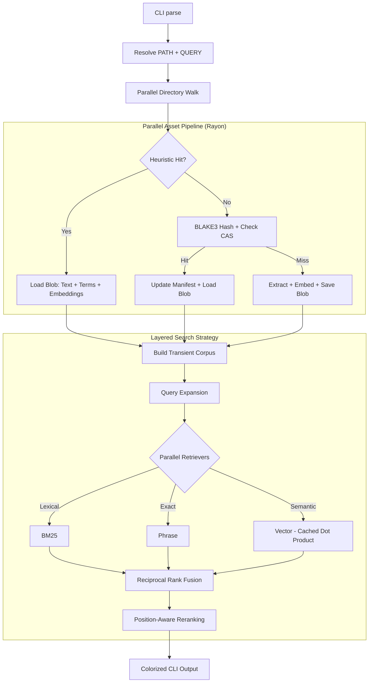

# sift

[](https://github.com/rupurt/sift/actions/workflows/ci.yml)
[](.keel/README.md)

`sift` is a standalone Rust CLI for local document retrieval in agentic
workflows. It searches raw local corpora without a long-running daemon, uses a 
composable search strategy architecture, and employs a Zig-style heuristic 
caching system for near-instant repeated queries.

The core idea is simple: point `sift` at a directory, extract text on demand,
and run a layered search pipeline (Expansion, Retrieval, Fusion, Reranking). 
There is no external database, no daemon, and no background indexing service.

## Current Contract

- **Single Rust Binary:** No external database, daemon, or long-running service.
- **Pure-Rust Toolchain:** No C++ dependencies, enabling easy static binary distribution.
- **Parallel Execution:** Powered by `Rayon` for multi-core file extraction and benchmark evaluation.
- **Default Strategy:** Uses the `page-index-hybrid` champion preset (Lexical + Semantic).
- **Layered Pipeline:** Query Expansion -> Retrieval -> Fusion -> Reranking.
- **Heuristic Incremental Caching:** Uses `mtime`, `inode`, and `size` to bypass 
  extraction and hashing for unchanged files.
- **Fully Processed Assets:** Cache blobs contain text, term stats, and pre-computed
  dense vector embeddings, enabling search at dot-product speeds.
- **Dense Inference:** Runs locally through Candle with
  `sentence-transformers/all-MiniLM-L6-v2` as the current default model.
- **Supported Inputs:** Text, HTML, PDF, and OOXML files (`.docx`, `.xlsx`, `.pptx`).

## How Sift Works

At runtime, `sift` orchestrates a high-performance asset pipeline:



## Performance & Scalability

`sift` is optimized for speed without sacrificing its stateless UX:
- **Zero-Inference Search:** On repeated queries, neural network inference is bypassed entirely by loading pre-computed embeddings from the global blob store.
- **Multi-Core Loading:** File extraction and vectorization are distributed across all available CPU cores.
- **Fast Path Heuristics:** Filesystem metadata checks happen in microseconds, allowing `sift` to skip hashing for unchanged files.

## Search Examples

The default strategy (champion alias `page-index-hybrid`) is used automatically:

```bash
sift search tests/fixtures/rich-docs "architecture decision"
```

Force a specific strategy or override components:

```bash
# Lexical only (no vectors)
sift search --strategy page-index "service catalog"

# Semantic only (vectors)
sift search --strategy vector "architecture"

# Custom mix
sift search --retrievers bm25,vector --reranking none "query"
```

### Verbose Mode
Trace the pipeline and timings at different levels:
- `-v`: Phase timings (Loading, Retrieval, etc.)
- `-vv`: Detailed retriever timings and cache hit/miss traces.
- `-vvv`: Granular internal scoring data.

## Configuration & Customization

- **[CONFIGURATION.md](CONFIGURATION.md):** Guide to `sift.toml`, available strategies, and environment variables.
- **[EVALUATION.md](EVALUATION.md):** How to manage datasets and run quality/latency evaluations.
- **[ARCHITECTURE.md](ARCHITECTURE.md):** Deep dive into the hexagonal design and asset pipeline.

## License

MIT OR Apache-2.0
