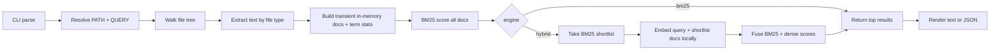
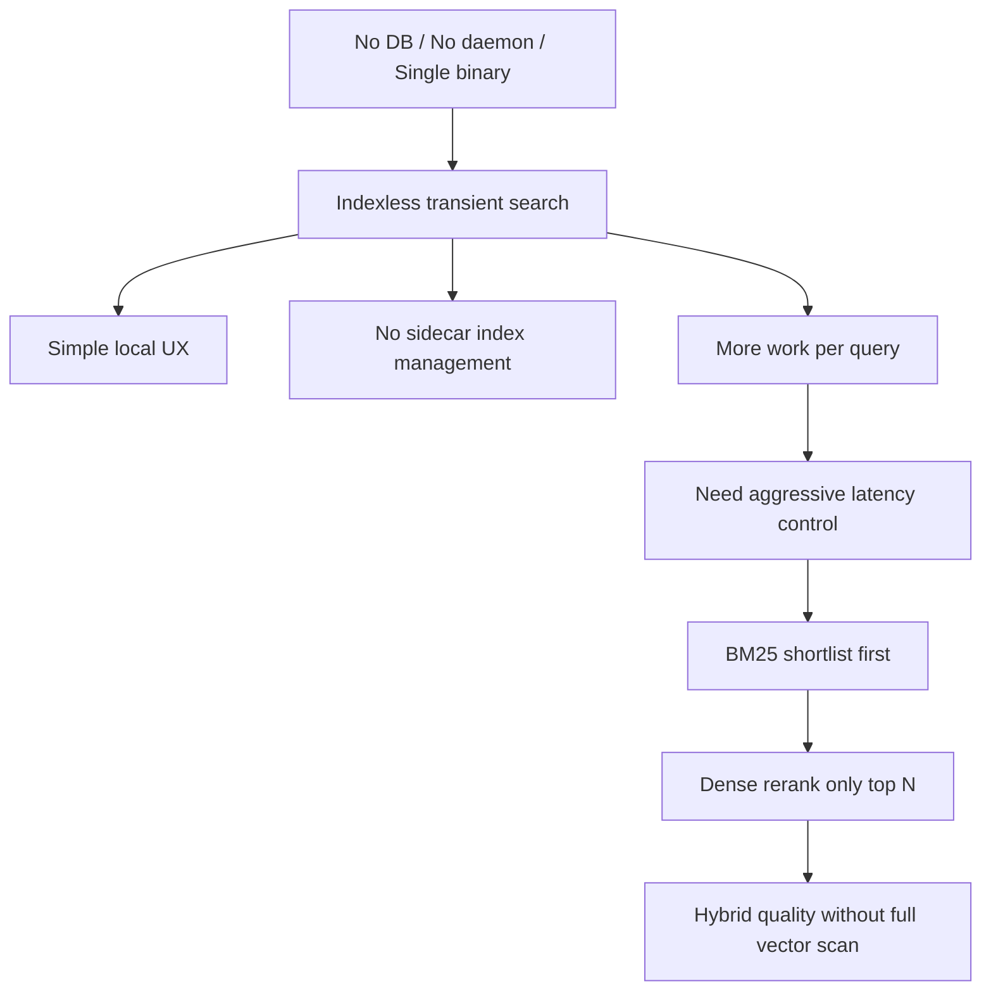
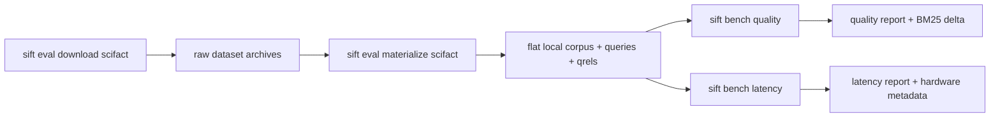

# sift

`sift` is a standalone Rust CLI for local document retrieval in agentic
workflows. It searches raw local corpora without a persisted index, defaults to
hybrid BM25 plus dense reranking, and keeps evaluation and benchmark workflows
inside the same binary.

The core idea is simple: point `sift` at a directory, extract text on demand,
rank everything lexically with BM25, and then rerank the best candidates with a
small local embedding model. There is no external database, no daemon, and no
background indexing service.

## Current Contract

- Single Rust binary. No external database, daemon, or long-running service.
- Default `search` mode is hybrid BM25 plus dense reranking.
- Corpus loading is transient and query-time. Sift does not write persisted
  sidecar indexes.
- Dense inference runs locally through Candle with
  `sentence-transformers/all-MiniLM-L6-v2` as the current default model.
- Supported inputs today: ASCII and UTF-8 text, HTML, text-bearing PDF, and
  OOXML Office files (`.docx`, `.xlsx`, `.pptx`).
- Target platforms are Linux and macOS. Windows is still unverified.

## How Sift Works

At runtime, `sift` follows this path:



In linear terms:

1. `sift search [PATH] <QUERY>` resolves the search root. If `PATH` is omitted,
   it searches the current directory.
2. The corpus is scanned recursively and text is extracted per file type.
3. `sift` builds an ephemeral in-memory BM25 index from the extracted text.
4. BM25 scores the full corpus.
5. In hybrid mode, only the top BM25 shortlist is sent through the local dense
   reranker.
6. BM25 and dense scores are normalized and fused into the final ranking.
7. Results are rendered as human-readable text or JSON.

## Design Choices

These are the deliberate tradeoffs behind the current design:

- No persisted corpus index. Search structures are rebuilt per query so the
  tool stays stateless and does not require index lifecycle management.
- Hybrid by default. BM25 is cheap and precise for filtering; dense reranking
  improves semantic recall on the shortlist without paying full-corpus vector
  cost.
- Pure-Rust local inference. Dense reranking uses Candle and local model files
  instead of Python bindings or a separate model server.
- Short dense context by default. The default `max_length` is `40`, which keeps
  reranking fast enough for laptop CPU usage.
- One extraction boundary. Text, HTML, PDF, and OOXML files all normalize into
  the same text-first search path.
- Deterministic ranking. Directory walking and tie-breaking are stable, which
  matters for agent workflows and benchmark reproducibility.

This is the main performance strategy:



## Installation

For development, enter the shared shell first:

```bash
nix develop
```

Build locally and mirror the binary back into repo-local `target/`:

```bash
just build release
./target/release/sift --help
```

Install locally from source if you want `sift` on your `PATH`:

```bash
cargo install --path .
```

## Search

Hybrid search is the default:

```bash
sift search tests/fixtures/rich-docs "architecture decision"
```

If you omit the path, `sift` searches the current directory:

```bash
sift search "architecture decision"
```

Request JSON output for agent consumption:

```bash
sift search --json tests/fixtures/rich-docs "quarterly roadmap"
```

Force lexical-only BM25 search when you want a baseline:

```bash
sift search --engine bm25 tests/fixtures/rich-docs "service catalog"
```

Override dense model settings explicitly:

```bash
sift search \
  --model-id sentence-transformers/all-MiniLM-L6-v2 \
  --max-length 40 \
  .cache/eval/scifact-files \
  "retrieval architecture"
```

The first hybrid query may download model assets into the local model cache if
they are not already present. That cache stores model files only, not a corpus
index.

## Evaluation And Benchmarks

The evaluation loop uses the same ranking pipeline as normal search:



Download and materialize the SciFact evaluation corpus:

```bash
sift eval download scifact --out .cache/eval/scifact
sift eval materialize scifact \
  --source .cache/eval/scifact \
  --out .cache/eval/scifact-files
```

Measure hybrid quality against BM25:

```bash
sift bench quality \
  --engine hybrid \
  --baseline bm25 \
  --corpus .cache/eval/scifact-files \
  --qrels .cache/eval/scifact/qrels/test.tsv
```

Measure search latency:

```bash
sift bench latency \
  --engine hybrid \
  --corpus .cache/eval/scifact-files \
  --queries .cache/eval/scifact-files/test-queries.tsv
```

Benchmark reports include the exact command, corpus size, git SHA, hardware
summary, dense model settings, and measured metrics so results are traceable.

## Recorded Evidence

The current README claims are grounded in board evidence already checked into
`.keel/`:

- On the recorded SciFact run over 5,183 documents, hybrid search improved
  nDCG@10 from 0.6647 to 0.6764 and MRR@10 from 0.6328 to 0.6466 over BM25,
  using `all-MiniLM-L6-v2` with shortlist 8 and `max_length` 40.
- On the same recorded hybrid latency run, p50 was 170.2 ms and p90 was
  180.8 ms, with the worst query at 214.7 ms.
- The rich-document fixture corpus now exercises HTML, PDF, `.docx`, `.xlsx`,
  and `.pptx` extraction through the same search path and benchmark loaders.

## Current Limits

- No OCR or scanned-image PDF recovery.
- No legacy binary Office formats (`.doc`, `.xls`, `.ppt`).
- No persisted database or background indexing service.

## License

MIT OR Apache-2.0
