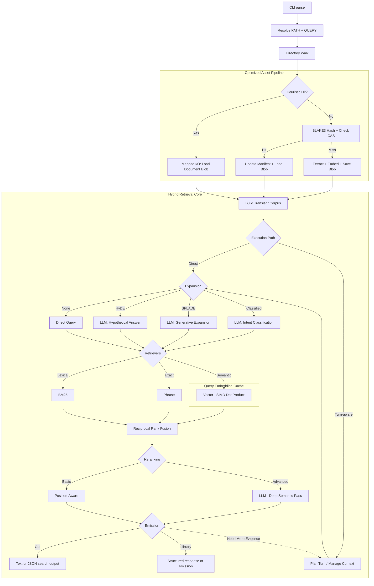

# sift

[](https://github.com/rupurt/sift/actions/workflows/ci.yml)
[](.keel/README.md)
[](RELEASE.md)

`sift` is a standalone Rust CLI and library for hybrid and agentic local search
in development workflows. The shipped executable gives you direct single-turn
search, evaluation, dataset, and prompt-optimization commands; the crate-root
library facade already exposes deterministic turn-aware and controller-style
search APIs for embedding.

The core idea is simple: point `sift` at a directory, extract text on demand,
and run a layered pipeline of expansion, retrieval, fusion, and reranking.
Agentic behavior in Sift is built on top of that same retrieval substrate
rather than replacing it with a separate service or daemon.

For project background and design rationale, read the introductory post:
[`Sift: Local Hybrid Search Without the Infrastructure Tax`](https://www.alexdk.com/blog/introducing-sift).

## Current Contract

- **Single Rust binary:** No external database, daemon, or long-running service.
- **Local-first retrieval:** Search runs over local corpora with transparent caching in standard user cache directories.
- **Default interactive strategy:** The default config strategy is `hybrid`.
- **Current champion preset:** `page-index-hybrid` is the richer benchmark preset for comparative evaluation.
- **Layered pipeline:** Query Expansion -> Retrieval -> Fusion -> Reranking.
- **Executable surface:** `search`, `eval`, `dataset`, `optimize`, and `config` are the supported CLI commands.
- **Library surface:** `search`, `assemble_context`, `search_turn`, and `search_controller` are supported at the crate root.
- **Emission modes:** Turn-aware library calls can emit `view`, `protocol`, or `latent` responses.
- **Supported inputs:** Text, HTML, PDF, and OOXML files (`.docx`, `.xlsx`, `.pptx`).

## Installation

### Homebrew (macOS and Linux)

```bash
brew tap rupurt/homebrew-tap
brew install sift
```

### One-liner Install (macOS and Linux)

```bash
curl --proto '=https' --tlsv1.2 -LsSf https://github.com/rupurt/sift/releases/latest/download/sift-installer.sh | sh
```

### Manual Download

Download the latest pre-built binaries and installers for your platform from the [GitHub Releases](https://github.com/rupurt/sift/releases) page. We provide:
- **Linux:** `.tar.gz` archives plus the cross-platform shell installer
- **macOS:** `.tar.gz` archives plus the cross-platform shell installer
- **Windows:** `.zip` archives, `.msi`, and the PowerShell installer

## CLI Interface

The executable currently exposes the following command groups:

| Command | Purpose |
|---------|---------|
| `sift search [OPTIONS] [PATH] <QUERY>` | Direct single-turn search over a local corpus. |
| `sift eval all` | Compare all registered retrieval strategies. |
| `sift eval quality` | Emit a JSON quality report for one strategy, optionally against a baseline. |
| `sift eval latency` | Emit a JSON latency report for one strategy. |
| `sift eval agentic` | Run planned multi-turn controller fixtures and compare them against a collapsed single-turn baseline. |
| `sift dataset download|materialize` | Manage evaluation datasets such as SciFact. |
| `sift optimize` | Tune prompt templates used by generative expansion. |
| `sift config` | Print the merged effective configuration. |

There is not yet a general-purpose `sift agentic` interactive CLI command. The
turn-aware controller surface is library-first today, while the executable
exposes agentic behavior primarily through `eval agentic`.

## Search Examples

Search with the default configured strategy (`hybrid` unless overridden in
`sift.toml`):

```bash
sift search tests/fixtures/rich-docs "architecture decision"
```

Run the current benchmark champion preset explicitly:

```bash
sift search --strategy page-index-hybrid tests/fixtures/rich-docs "architecture decision"
```

Use a simpler lexical-only plan:

```bash
sift search --strategy bm25 "service catalog"
```

Use a vector-only plan:

```bash
sift search --strategy vector "architecture"
```

Override individual pipeline stages:

```bash
sift search --retrievers bm25,phrase --reranking none "query"
```

Emit JSON instead of text:

```bash
sift search --json "query"
```

### Verbose Mode

Trace the pipeline and timings at different levels:

- `-v`: Phase timings
- `-vv`: Detailed retriever timings and cache traces
- `-vvv`: Granular internal scoring data

## Embedded Library

`sift` can also be embedded from another Rust project. The supported public
surface lives at the crate root and includes:

- `Sift`, `SiftBuilder`
- `SearchInput`, `SearchOptions`
- `ContextAssemblyRequest`, `ContextAssemblyResponse`
- `SearchTurnRequest`, `SearchTurnResponse`
- `SearchControllerRequest`, `SearchControllerResponse`
- `SearchEmission`, `SearchEmissionMode`
- `SearchPlan`, `QueryExpansionPolicy`, `RetrieverPolicy`, `FusionPolicy`, `RerankingPolicy`
- `Retriever`, `Fusion`, `Reranking`
- `SearchResponse`, `SearchHit`, `ContextArtifact`, `ContextArtifactKind`, `ScoreConfidence`

Everything under `sift::internal` exists to support the bundled executable,
benchmarks, and repository-internal tests. It is not part of the stable
embedding contract.

See [LIBRARY.md](LIBRARY.md) for the full embedding guide, including direct
search, context assembly, protocol/latent emissions, local context injection,
and deterministic multi-turn controller usage.

### Runnable Example Consumer

[`examples/sift-embed`](examples/sift-embed) is the canonical runnable
embedding reference. It is a standalone Rust crate that depends on `sift`
through the crate-root facade and exposes a minimal `sift-embed` CLI.

From the repo root:

```bash
just embed-build
just embed-sift tests/fixtures/rich-docs "architecture decision"
```

You can also run the example directly:

```bash
cargo run --manifest-path examples/sift-embed/Cargo.toml -- search "agentic search"
cargo run --manifest-path examples/sift-embed/Cargo.toml -- search tests/fixtures/rich-docs "architecture decision"
```

If `PATH` is omitted, `sift-embed search "<term>"` searches the current
directory. See [`examples/sift-embed/README.md`](examples/sift-embed/README.md)
for the runnable example notes.

### Add The Dependency

Use the git repository until a versioned registry release is part of your
delivery path:

```toml
[dependencies]
sift = { git = "https://github.com/rupurt/sift" }
```

For local development against a checked-out copy:

```toml
[dependencies]
sift = { path = "../sift" }
```

### Minimal Embedding Example

```rust
use sift::{Fusion, Retriever, Reranking, SearchInput, SearchOptions, Sift};

fn main() -> anyhow::Result<()> {
    let sift = Sift::builder().build();

    let response = sift.search(
        SearchInput::new("./docs", "agentic search").with_options(
            SearchOptions::default()
                .with_strategy("bm25")
                .with_retrievers(vec![Retriever::Bm25])
                .with_fusion(Fusion::Rrf)
                .with_reranking(Reranking::None)
                .with_limit(5)
                .with_shortlist(5),
        ),
    )?;

    for hit in response.hits {
        println!("{} {}", hit.rank, hit.path);
    }

    Ok(())
}
```

## How Sift Works

At runtime, `sift` orchestrates a high-performance asset pipeline and retrieval
runtime that can be invoked directly or wrapped by a turn-aware controller:



Today the executable ships direct search plus evaluation-oriented agentic
fixtures. The library already exposes deterministic turn-aware controller
surfaces. Fully autonomous planning and decomposition remain the next formal
layer.

## Performance & Scalability

`sift` is optimized for speed without sacrificing its stateless UX:

- **Zero-inference repeat search:** Reuses cached document blobs and query embeddings where possible.
- **SIMD acceleration:** Vector similarity calculations use hardware-specific SIMD instructions.
- **Mapped I/O:** Uses `mmap` for document blob reads.
- **Fast-path heuristics:** Filesystem metadata checks allow unchanged files to bypass hashing and extraction.

## Documentation Map

- **[USER_GUIDE.md](USER_GUIDE.md):** End-user guide for direct search workflows.
- **[CONFIGURATION.md](CONFIGURATION.md):** `sift.toml`, strategies, prompts, and environment variables.
- **[EVALUATIONS.md](EVALUATIONS.md):** Retrieval and agentic evaluation workflows.
- **[LIBRARY.md](LIBRARY.md):** Crate-root embedding guide for all supported library modes.
- **[ARCHITECTURE.md](ARCHITECTURE.md):** Architecture, execution seams, and implementation status.

## License

This project is licensed under the [MIT License](LICENSE).
